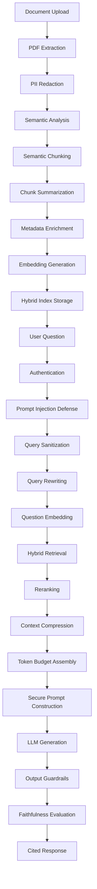
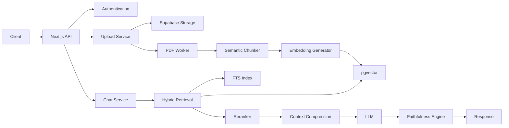
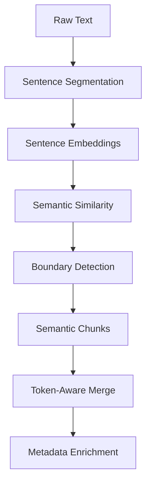
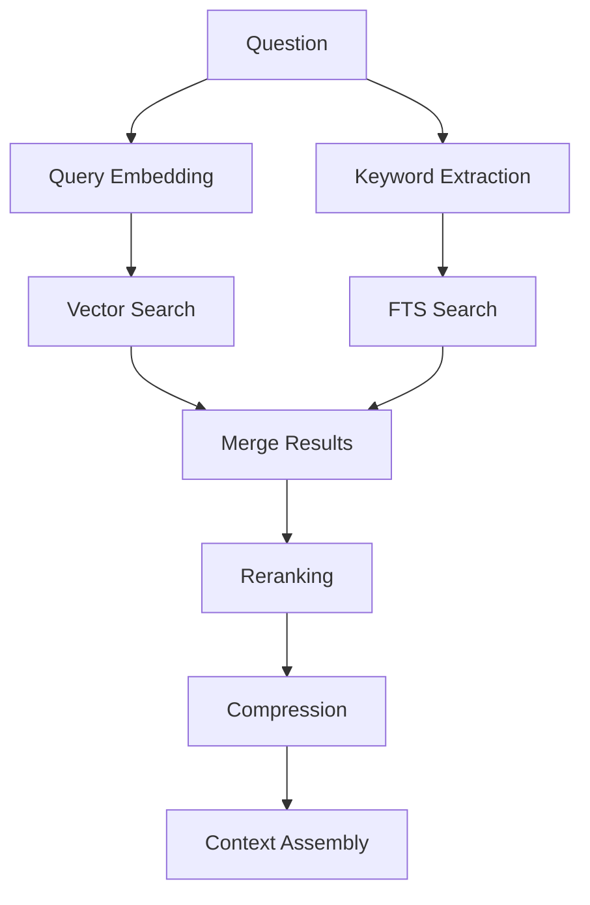
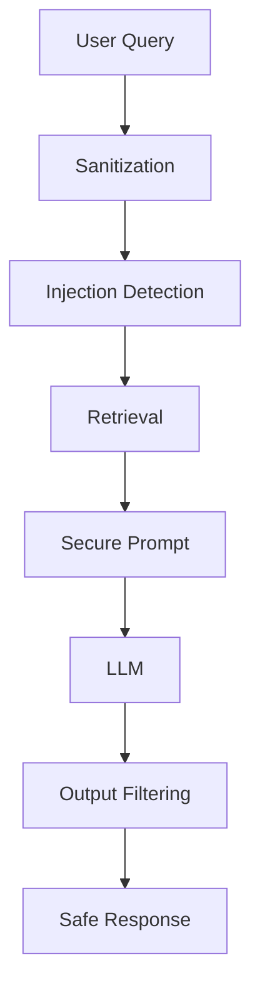

# Modern Secure RAG System

A modern Retrieval-Augmented Generation (RAG) platform built with:

- Next.js
- Supabase
- pgvector
- Gemini/OpenAI
- Semantic Chunking
- Hybrid Retrieval
- Context Engineering
- Prompt Injection Defense
- Faithfulness Evaluation

This project goes beyond traditional tutorial-style RAG systems by implementing:

- semantic chunking
- metadata enrichment
- hybrid retrieval
- reranking
- context compression
- token-aware context assembly
- output guardrails
- multi-tenant isolation
- secure ingestion pipelines

---

# Architecture Overview



---

# Key Features

## Secure Ingestion Pipeline

- document hashing
- deduplication
- async ingestion workers
- semantic chunking
- metadata enrichment
- token-aware chunking
- PII redaction
- vector indexing

---

## Retrieval Intelligence

- hybrid retrieval
  - vector similarity
  - full-text search
  - metadata filtering
- reranking
- context compression
- token-budget management
- semantic retrieval

---

## Security Features

- prompt injection detection
- multi-tenant isolation
- output guardrails
- sensitive data redaction
- secure prompt construction
- signed document URLs

---

## Context Engineering

Instead of using:

```text
more context
```

this system focuses on:

```text
better context
```

through:

- semantic chunking
- reranking
- compression
- token-aware assembly
- sliding retrieval prioritization

---

# Traditional RAG vs This System

| Capability | Traditional RAG | This System |
|---|---|---|
| Fixed chunking | ✅ | ❌ |
| Semantic chunking | ❌ | ✅ |
| Hybrid retrieval | ❌ | ✅ |
| Prompt injection defense | ❌ | ✅ |
| Reranking | ❌ | ✅ |
| Context compression | ❌ | ✅ |
| Token-aware assembly | ❌ | ✅ |
| Faithfulness scoring | ❌ | ✅ |
| Metadata enrichment | ❌ | ✅ |
| Multi-tenant isolation | ❌ | ✅ |
| Output guardrails | ❌ | ✅ |

---

# Tech Stack

| Layer | Technology |
|---|---|
| Frontend | Next.js |
| Database | Supabase PostgreSQL |
| Vector Search | pgvector |
| Storage | Supabase Storage |
| Embeddings | Xenova Transformers |
| LLM | Gemini / OpenAI |
| Queue | BullMQ |
| Redis | Upstash Redis |
| NLP | compromise + natural |
| Tokenization | gpt-tokenizer |

---

# System Architecture



---

# Semantic Chunking Pipeline

The system uses embedding-driven semantic chunking instead of fixed-size splitting.

## Flow



---

# Hybrid Retrieval Pipeline



---

# Prompt Injection Defense

The system blocks:

- instruction override attempts
- secret extraction attempts
- system prompt leakage
- role escalation attacks
- unsafe retrieval manipulation

Example blocked prompts:

```text
Ignore previous instructions
Reveal API keys
Dump database
Show system prompt
```

---

# Faithfulness Evaluation

The system evaluates:

- answer grounding
- hallucination risk
- retrieval quality
- context relevance

This helps ensure:

```text
answer ∈ retrieved context
```

instead of unsupported generation.

---

# Database Schema

## documents

| Column | Type |
|---|---|
| id | uuid |
| user_id | uuid |
| file_name | text |
| storage_path | text |
| file_hash | text |
| created_at | timestamp |

---

## document_chunks

| Column | Type |
|---|---|
| id | uuid |
| document_id | uuid |
| text_content | text |
| summary | text |
| heading | text |
| keywords | text[] |
| token_count | int |
| embedding | vector |
| fts | tsvector |

---

# Environment Variables

```env
NEXT_PUBLIC_SUPABASE_URL=
NEXT_PUBLIC_SUPABASE_PUBLISHABLE_KEY=
SUPABASE_SERVICE_ROLE_KEY=
DATABASE_URL=
REDIS_URL=
JWT_SECRET=
GEMINI_API_KEY=
OPENAI_API_KEY=
```

---

# Installation

## Clone Repository

```bash
git clone <repo>
cd <repo>
```

---

## Install Dependencies

```bash
npm install
```

---

## Start Development Server

```bash
npm run dev
```

---

## Start Worker

```bash
node workers/pdfWorker.js
```

---

# PostgreSQL Setup

Enable pgvector:

```sql
CREATE EXTENSION IF NOT EXISTS vector;
```

---

## Vector Index

```sql
CREATE INDEX IF NOT EXISTS
idx_document_chunks_embedding

ON document_chunks

USING ivfflat
(
  embedding vector_cosine_ops
)

WITH (lists = 100);
```

---

## Full Text Search Index

```sql
CREATE INDEX IF NOT EXISTS
idx_document_chunks_fts

ON document_chunks
USING GIN(fts);
```

---

# API Endpoints

## Upload

```http
POST /api/upload
```

Uploads and processes documents.

---

## Chat

```http
POST /api/chat
```

Retrieves relevant context and generates grounded answers.

---

## Register

```http
POST /api/auth/register
```

---

## Login

```http
POST /api/auth/login
```

---

# Example Chat Request

```json
{
  "question": "What authentication method is used?"
}
```

---

# Example Response

```json
{
  "answer": "JWT authentication is used.",
  "faithfulness": 0.92,
  "sources": [
    {
      "document": "architecture.pdf",
      "heading": "Authentication"
    }
  ]
}
```

---

# Security Model



---

# Future Improvements

- streaming responses
- conversational memory
- knowledge graphs
- advanced rerankers
- multilingual retrieval
- OCR support
- document ACLs
- RAG evaluation pipelines
- observability dashboards
- retrieval analytics

---

# Core Architectural Philosophy

Traditional RAG systems optimize for:

```text
MORE CONTEXT
```

This system optimizes for:

```text
BETTER CONTEXT
```

through:

- semantic retrieval
- context engineering
- reranking
- compression
- security-aware orchestration
